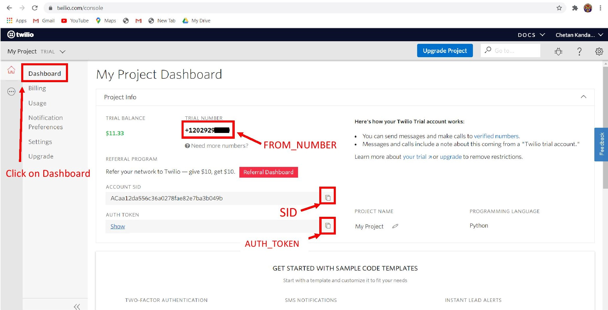
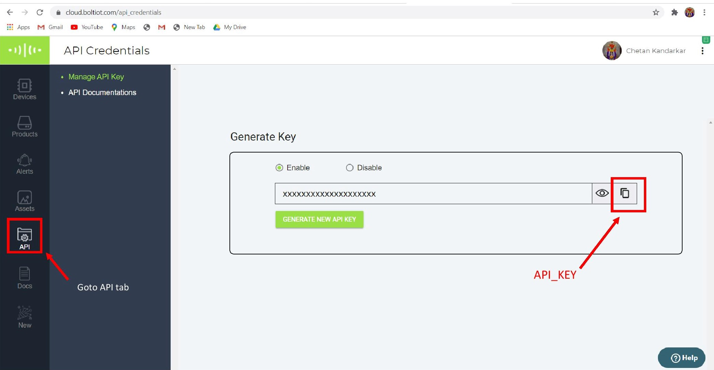
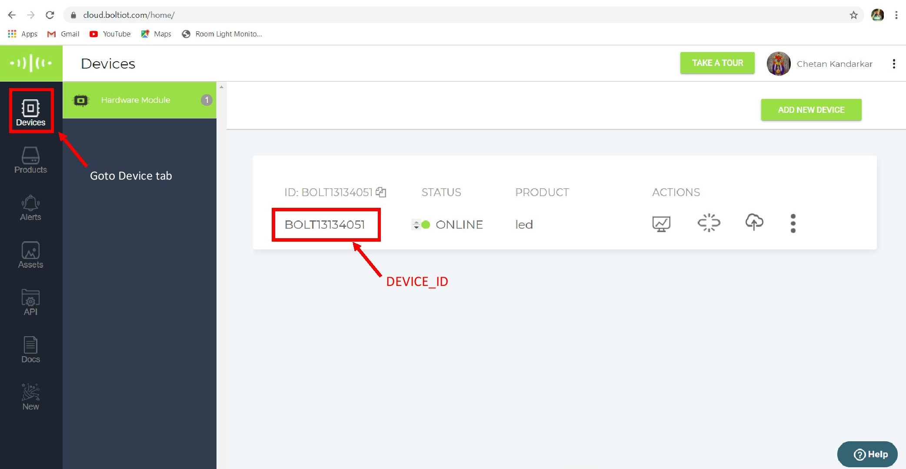
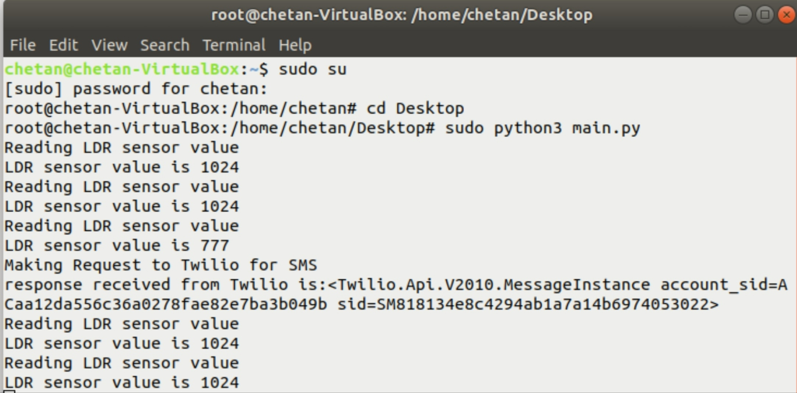
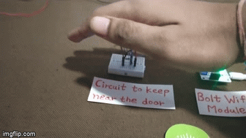

# Alert-for-wearing-mask
Bolt IoT Project

## Objective : This project system reminds to wear a mask when you go out from the home

## Requirements :

#### Hardware components

- Bolt IoT Bolt WiFi Module
- LDR, 5 Mohm
- Buzzer
- Resistor 10k ohm	
- Breadboard (generic)	
- Male/Female Jumper Wires	
- USB-A to Mini-USB Cable

#### Software apps and online services

- Bolt IoT Bolt Cloud
- SMS Messaging API	
- Twilio SMS Messaging API
- VM VirtualBox

## Story
Corona virus disease (COVID-19) spread when mucus or droplets containing the virus get into your body through your eyes, nose or throat.people can catch COVID-19 from others who have the virus. The disease can spread from person to person through small droplets from the nose or mouth which are spread when a person with COVID-19 coughs or exhales. These droplets land on objects and surfaces around the person.

During a global pandemic, the cheapest, easiest and most important way to prevent the spread of the virus is to wear a mask when going out of the house.It is great if you are into the habit of wearing a mask when going out of the house. But if you don't have this habit, then it is a bit difficult to form this habit. Luckily you can build a quick reminder system for yourself to wear a mask when going out of the house using the Bolt IoT Platform.

## Hardware Setup :

Step 1] Power up the Bolt WiFi module using the USB power supply.

Step 2] If you have not already done so, [click here](https://info.boltiot.com/how-to-setup-bolt) to see a video which will you how to configure the Bolt WiFi module to connect to the internet.

Step 3] Now make the hardware connections as shown in the figure below.

Step 4] Place the Bolt WiFi module along with the breadboard just at the entrance of your house such that whenever a person comes in, his shadow should fall on the circuit

Step 5] Place the buzzer on a mask stand so whenever buzzer is on our attention goes towards the mask.

## Creating an account on Twilio

Step 1: Open [https://www.twilio.com/](https://www.twilio.com/) in browser.

Step 2: Click on "Get a Free API Keybutton" to sign up.

Step 3: Fill all the necessary details in SIGN UP form.

Step 4: To verify they will ask for your phone number. Choose India as an option in the dropdown and then enter your phone number.

Step 5: Click on "Products". Now enable the SMS services by clicking on two checkboxes for Programmable SMS and Phone Numbers.

Once you have done this, scroll to the bottom of the screen and click on "Continue".

Step 6: Now, you will need to give a name for your project. I have given the name as My Project. Click on "Continue" once you have entered the project name.

Step 7: Click on "Skip this step" when it asks you to Invite a Teammate.

Step 8: Your project should be created at this point. Click on "Project Info" to view the account credentials which is required for your projects.

Step 9: You can view the Account SID and Auth token on this page. The Auth token is not visible by default, you can click on "view" button to make the Auth token visible.

Step 10: From the drop-down menu, choose "Programmable SMS". Now click on Get Started button to generate phone number.

Step 11: Click on Get a number button.

Step 12: Then a popup will appear. Click on Choose this number button

Step 13: Then a popup will appear which will have the final number.

## Install Ubuntu on VirtualBox
1] Download VM VirtualBox on your pc using following link
[https://www.virtualbox.org/wiki/Downloads](https://www.virtualbox.org/wiki/Downloads)

2] Then install ubuntu on VirtualBox.

Go to your ubuntu terminal and install the required software using the following instructions.

- sudo apt-get -y update
- sudo apt install python3-pip
- sudo pip3 install boltiot

## Copy API, Token and device id
Step 1] Log in to [twilio.com](twilio.com) and copy the SID, AUTH_TOKEN, FROM_NUMBER and save it for further use as shown in pictures.

Step 2] Also login to [cloud.boltiot.com](cloud.boltiot.com) copy the API_KEY, DEVICE_ID and save it.

## Create conf.py file

Use the "sudo nano conf.py" command in your ubuntu terminal to create a python file and add the "conf.py" code to the python file.

Do all changes very carefully that said in the code.

Exit the nano editor by pressing "ctrl +x" and then press Y

## Create main.py file

Use the "sudo nano main.py" command in your ubuntu terminal to create a python file and add the "main.py" code to the python file.

Exit the nano editor by pressing "ctrl +x" and then press Y.

## Run the code

Now Run the main.py file using the following command

- sudo python3 main.py

The output of the program will look like the below image.

In the output we see value of the LDR sensor. this value getting from the value of the LDR resistance of LDR circuit.

## Working:

When we moves our hand closer to the LDR circuit. Buzzer will be turn on for 5 seconds.

At the same time we receive SMS on our mobile

"Please Don't forget to wear your mask"

So this will remind us to wear mask when we going out of the house

## Video Demonstration :

[Click Here](https://youtu.be/VaXRzphYww0)

## Conclusion :
The system will start working as expected. Whenever a person walks near the LDR circuit the buzzer will run for 5 seconds and also receive a SMS on the mobile. System reminding him to wear a mask when going out of the house. This system will produce alert every time and you will be able to fight off the COVID-19 disease.

